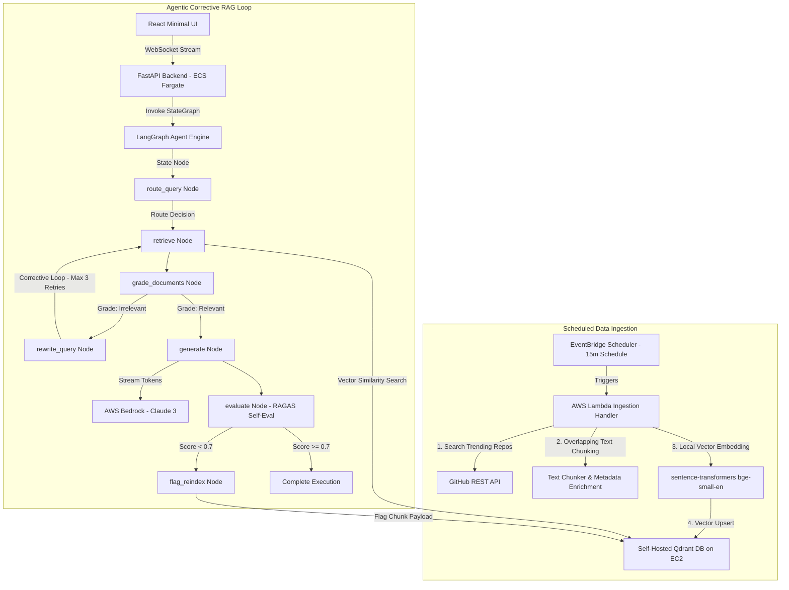

#  Agentic RAG System for GitHub Trending Repositories

> **A portfolio-grade Agentic Retrieval-Augmented Generation (CRAG) system that polls GitHub's trending data in real-time, embeds repository documentation, and answers queries using a stateful LangGraph agent, AWS Bedrock, self-hosted Qdrant, and an integrated evaluation feedback loop.**

---

##  Executive Overview & Key Differentiators

Most RAG implementations are simple, static "chat with your PDF" scripts. This system introduces three production-grade engineering differentiators:

1. **Near Real-Time Automated Data Ingestion:** Scheduled polling via **AWS Lambda** and **EventBridge Scheduler** (no static manual file uploads).
2. **Corrective RAG (CRAG) Agentic Loop:** A stateful **LangGraph** engine featuring intent routing, document relevance grading, adaptive query rewriting, and bounded retry caps.
3. **Self-Evaluating Feedback Loop:** Integrated evaluation scoring (**RAGAS** criteria for context precision and faithfulness) that automatically flags low-scoring chunks for re-indexing.
4. **Real-Time Token & Telemetry Streaming:** Bi-directional **FastAPI WebSockets** streaming live graph node state transitions alongside **AWS Bedrock Claude** token generation to a minimal **React** dashboard.
5. **100% Infrastructure as Code (IaC):** Complete **Terraform** specs for AWS ECS Fargate, ALB, VPC, Lambda, IAM roles, and self-hosted Qdrant on EC2.

---

##  System Architecture



---

##  Project Architecture & File Tree

```
agentic-rag/
├── README.md                           # Documentation
├── .env.example                         # Environment variable template
├── docs/
│   └── architecture.md                 # Detailed architecture documentation
├── infra/                              # Terraform Infrastructure as Code (IaC)
│   ├── main.tf                         # Provider & AWS state setup
│   ├── vpc.tf                          # VPC, subnets, IGW, security groups
│   ├── ec2_qdrant.tf                   # Self-hosted Qdrant EC2 instance definition
│   ├── ecs.tf                          # ECS Fargate cluster, task defs & ALB
│   ├── lambda_ingestion.tf             # Lambda function & EventBridge 15m rule
│   ├── iam.tf                          # ECS & Lambda least-privilege IAM roles
│   ├── variables.tf                    # Parameterized variables
│   └── outputs.tf                      # ALB DNS & Qdrant endpoints
├── backend/                            # FastAPI & LangGraph Engine
│   ├── app/
│   │   ├── main.py                     # FastAPI application entrypoint
│   │   ├── config.py                   # Pydantic Settings configuration
│   │   ├── api/
│   │   │   ├── routes.py               # REST API & query history telemetry
│   │   │   └── websocket.py            # Real-time WebSocket token streamer
│   │   ├── graph/
│   │   │   ├── state.py                # TypedDict state schema & retries accumulator
│   │   │   ├── graph.py                # LangGraph StateGraph & conditional routers
│   │   │   └── nodes/
│   │   │       ├── route_query.py      # Intent classifier node
│   │   │       ├── retrieve.py         # Qdrant vector search node
│   │   │       ├── grade_documents.py  # LLM document relevance grader node
│   │   │       ├── rewrite_query.py    # Query reformulation node
│   │   │       ├── generate.py         # Bedrock answer synthesizer node
│   │   │       ├── evaluate.py         # Self-evaluation RAGAS node
│   │   │       └── flag_reindex.py     # Low-score payload flagger node
│   │   └── services/
│   │       ├── qdrant_client.py        # Qdrant Python SDK wrapper
│   │       ├── bedrock_client.py       # boto3 Bedrock Runtime SDK wrapper
│   │       └── embeddings.py           # sentence-transformers bge-small-en model
│   ├── requirements.txt                # Python dependencies
│   └── Dockerfile                      # Container production build
├── ingestion/                          # Scheduled Ingestion Engine
│   ├── lambda_handler.py               # AWS Lambda entrypoint
│   ├── fetch_github.py                 # GitHub REST API repository fetcher
│   ├── chunker.py                      # Overlapping text chunker & metadata
│   └── requirements.txt                # Ingestion dependencies
├── frontend/                           # React Minimalist Monochrome UI
│   ├── src/
│   │   ├── components/
│   │   │   ├── ChatPanel.jsx           # Real-time streaming chat interface
│   │   │   └── Dashboard.jsx           # Query telemetry & analytics dashboard
│   │   ├── App.jsx                     # Layout container & tab navigation
│   │   ├── main.jsx                    # React DOM entrypoint
│   │   └── index.css                   # Tailwind & JetBrains Mono typography
│   ├── index.html                      # HTML entrypoint
│   └── package.json                    # Node dependencies
├── tests/                              # Pytest Suite
│   ├── conftest.py                     # Test environment setup
│   ├── test_graph.py                   # Graph state & routing unit tests
│   └── test_retrieval.py               # Local embedding & vector search tests
└── .github/workflows/ci.yml           # GitHub Actions CI workflow pipeline
```

---

## ⚡ Quickstart Guide

### 1. Prerequisites
* Python 3.11+
* Node.js 18+
* Git

### 2. Backend Setup
```bash
cd backend
python -m venv venv
# On Windows:
venv\Scripts\activate
# On Linux/macOS:
source venv/bin/activate

pip install -r requirements.txt
uvicorn app.main:app --reload --port 8000
```
Verify health: `http://localhost:8000/health`

### 3. Frontend Setup
```bash
cd frontend
npm install
npm run dev
```
Open **`http://localhost:5173`** in your browser.

### 4. Running Unit Tests
```bash
pytest tests/ -v
```

---

## ☁️ Cloud Infrastructure Deployment (Terraform)

Deploy to AWS using your IAM credentials:

```bash
cd infra
aws configure
terraform init
terraform plan
terraform apply
```

Outputs will display the public Application Load Balancer URL (`alb_dns_name`).

---

##  Evaluation & Telemetry Metrics

The system monitors and logs telemetry for every query execution:
* **Faithfulness & Context Precision:** Automated RAGAS score ($0.0 - 1.0$).
* **Corrective RAG Path:** Flags whether a query took the `Straight-Through` path or `Corrective RAG (N Retries)` loop.
* **Latency:** End-to-end WebSocket stream duration.

---

## 📄 License
Distributed under the MIT License. See `LICENSE` for more information.
