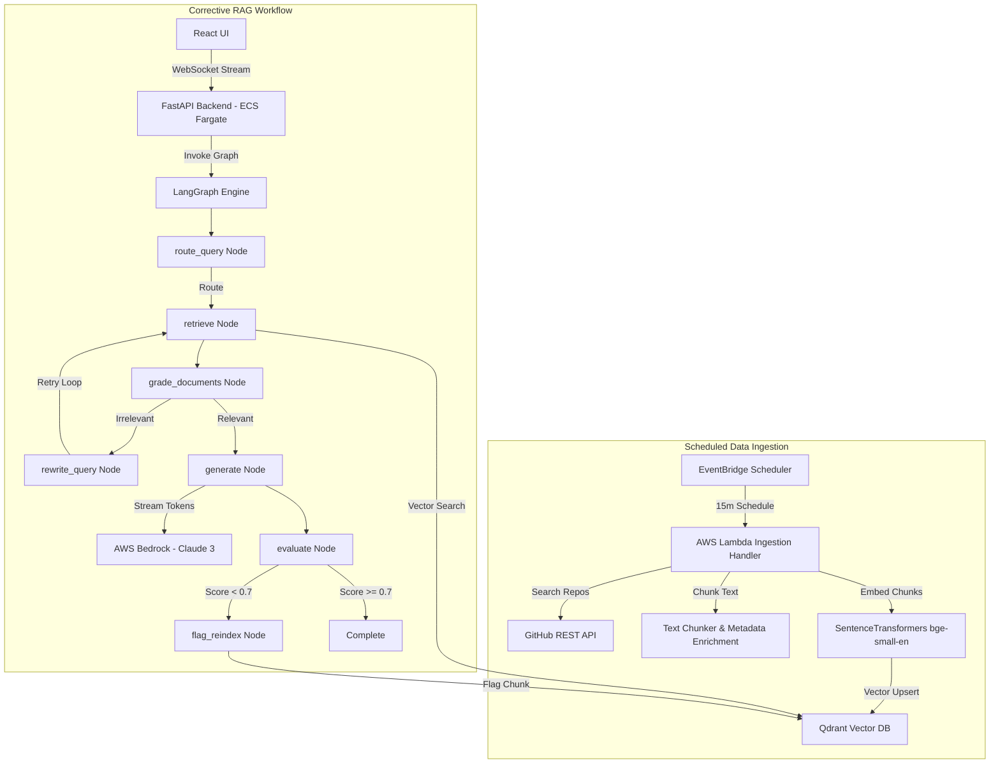

# Agentic RAG System for GitHub Trending Repositories

Agentic Retrieval-Augmented Generation (Corrective RAG) system that ingests GitHub trending repository data, embeds documentation into Qdrant, and processes developer queries through a stateful LangGraph execution engine powered by AWS Bedrock.

---

## Key Components

1. **Automated Data Ingestion:** Scheduled ingestion pipeline using AWS Lambda to fetch, chunk, and embed trending repository metadata.
2. **Corrective RAG (CRAG) Workflow:** Stateful LangGraph execution featuring intent routing, document relevance grading, adaptive query reformulation, and bounded retries.
3. **Self-Evaluating Feedback Loop:** Evaluation scoring assessing response faithfulness and relevancy, flagging low-confidence context chunks for re-indexing.
4. **Real-Time Streaming & Telemetry:** WebSocket streaming delivering graph state node transitions and response token generation to the React dashboard.
5. **Infrastructure as Code:** Terraform module for AWS ECS Fargate, ALB, VPC, Lambda, IAM roles, and EC2 Qdrant deployment.

---

## Architecture Overview



---

## Directory Structure

```
agentic-rag/
├── README.md
├── .env.example
├── docs/
│   └── architecture.md
├── infra/
│   ├── main.tf
│   ├── vpc.tf
│   ├── ec2_qdrant.tf
│   ├── ecs.tf
│   ├── lambda_ingestion.tf
│   ├── iam.tf
│   ├── variables.tf
│   └── outputs.tf
├── backend/
│   ├── app/
│   │   ├── main.py
│   │   ├── config.py
│   │   ├── api/
│   │   │   ├── routes.py
│   │   │   └── websocket.py
│   │   ├── graph/
│   │   │   ├── state.py
│   │   │   ├── graph.py
│   │   │   └── nodes/
│   │   │       ├── route_query.py
│   │   │       ├── retrieve.py
│   │   │       ├── grade_documents.py
│   │   │       ├── rewrite_query.py
│   │   │       ├── generate.py
│   │   │       ├── evaluate.py
│   │   │       └── flag_reindex.py
│   │   └── services/
│   │       ├── qdrant_client.py
│   │       ├── bedrock_client.py
│   │       └── embeddings.py
│   ├── requirements.txt
│   └── Dockerfile
├── ingestion/
│   ├── lambda_handler.py
│   ├── fetch_github.py
│   ├── chunker.py
│   └── requirements.txt
├── frontend/
│   ├── src/
│   │   ├── components/
│   │   │   ├── ChatPanel.jsx
│   │   │   └── Dashboard.jsx
│   │   ├── App.jsx
│   │   ├── main.jsx
│   │   └── index.css
│   ├── index.html
│   └── package.json
└── tests/
    ├── conftest.py
    ├── test_graph.py
    └── test_retrieval.py
```

---

## Quickstart Guide

### Prerequisites
* Python 3.11+
* Node.js 18+

### Backend Setup
```bash
cd backend
python -m venv venv

# Windows
venv\Scripts\activate
# Linux/macOS
source venv/bin/activate

pip install -r requirements.txt
uvicorn app.main:app --reload --port 8000
```
Health endpoint: `http://localhost:8000/health`

### Frontend Setup
```bash
cd frontend
npm install
npm run dev
```
Open `http://localhost:5173` in browser.

### Unit Tests
```bash
pytest tests/ -v
```

---

## Infrastructure Deployment

Deploying with Terraform:

```bash
cd infra
aws configure
terraform init
terraform plan
terraform apply
```

Outputs will return the load balancer endpoint (`alb_dns_name`).

---

## License
Distributed under the MIT License. See `LICENSE` for details.

