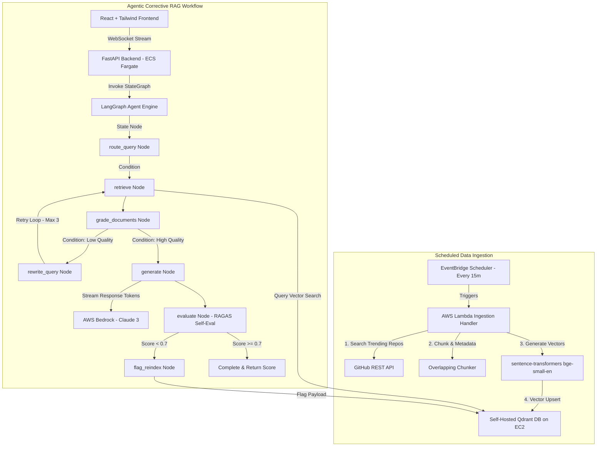

# System Architecture - Agentic RAG for GitHub Trending Repos

This document outlines the detailed system architecture, data ingestion pipelines, and stateful agent execution graph for the GitHub Trending Repos Agentic RAG system.

---

## 🏗️ High-Level Architecture

---

## 🔄 Component Breakdown

### 1. Scheduled Ingestion Engine (`ingestion/`)
* **EventBridge Scheduler:** Triggers the Lambda execution every 15–30 minutes.
* **GitHub API Fetcher:** Queries recently starred/created repositories dynamically.
* **Chunker:** Segments repo READMEs and descriptions into ~300-500 token overlapping chunks with metadata (`repo_name`, `url`, `ingested_at`).
* **Local Embedding Engine:** Encodes text chunks locally via `bge-small-en` (384-dim vectors) before storing in Qdrant.

### 2. LangGraph Agent Execution (`backend/app/graph/`)
* **`route_query`:** Decides if the query needs vector retrieval or can be answered directly.
* **`retrieve`:** Performs vector similarity search against Qdrant.
* **`grade_documents`:** Evaluates if retrieved chunks are relevant to the query.
* **`rewrite_query`:** Reformulates queries when document relevance grading fails, looping back to `retrieve` up to a hard cap of `MAX_RETRIEVAL_RETRIES=3`.
* **`generate`:** Prompts AWS Bedrock Claude model with retrieved context to synthesize answers.
* **`evaluate`:** Evaluates faithfulness and answer relevancy using automated scoring.
* **`flag_reindex`:** Flags low-scoring document chunks for re-indexing.

---

## ☁️ Infrastructure & AWS Topology (`infra/`)

* **VPC Networking:** Public subnets across Availability Zones with strict Security Groups.
* **Compute:** ECS Fargate service running FastAPI backend behind an Application Load Balancer (ALB).
* **Vector DB:** Qdrant self-hosted on a `t3.small` EC2 instance using Docker and persistent EBS storage.
* **IAM Security:** Fine-grained IAM roles granting Bedrock invoke permissions to ECS task and Lambda execution roles without static keys.
